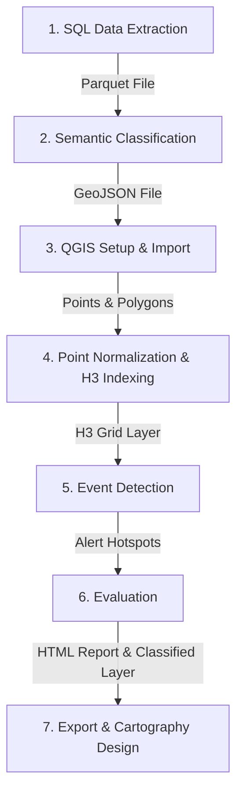

# Social Media Disaster Detection & Spatial Analysis Pipeline

A multi-phase geospatial-semantic analysis pipeline for detecting and evaluating natural disaster events (e.g., wildfires, earthquakes, hurricanes) using geolocalized tweets (social media data). 

This pipeline integrates Machine Learning (multilingual Transformer-based text classification) with Spatial Analysis (H3 discrete global grid systems, Getis-Ord $G_i^*$ spatial autocorrelation, and K-Ring soft evaluation metrics) inside QGIS.

---

## Process Overview (User Workflow)



1. **SQL Data Extraction**: Query tweets within a specific bounding box and period of interest (along with the exact same period of the previous year as a baseline).
   - **Output**: `.parquet` file.
2. **Semantic Classification (RoBERTa)**: Classify the extracted tweets using a fine-tuned multilingual RoBERTa model to filter natural disaster-related messages. Natural disaster-related tweets are labeled as `1` (Disaster-related) and others as `0` (Not disaster-related).
   - **Output**: `.geojson` and `.geoparquet` files.
3. **QGIS Setup and Data Import**: Load the classified GeoJSON file into QGIS overlaid on a base map layer (e.g., OpenStreetMap).
   - **Output**: Vector layers (Points and Polygons).
4. **Point Normalization and H3 Indexing**: Use QGIS's "Point on Surface" tool to normalize polygon locations based on the `user_location` field. Then, merge all points and index them into an Uber H3 hexagonal grid.
   - **Output**: All Tweets layer indexed in the H3 grid.
5. **Event Detection**: Execute the QGIS processing tool `event_detection.py` by providing the H3-indexed tweets, event year, and baseline year.
   - **Output**: Three layers: *All Event Tweets*, *Disaster-Related Tweets*, and *Event Detection (Disaster Alerts)*.
6. **Evaluation**: Compare detected event hotspots against the Ground Truth layer by running `h3_evaluation_metrics.py`. Provide the event detection layer, H3 Ground Truth layer, and base grid layer, along with parameters such as the K-ring search tolerance, usecase name, disaster type, and date.
   - **Output**: Classified evaluation vector layer and a premium styled HTML evaluation report.
7. **Data Export and Cartographic Design**: Export the evaluation layers in GeoJSON format and import them into ArcGIS for high-quality cartographic representation and styling.

---

## Directory Structure

```
.
├── P1_DataAcquisition-and-Pre-Filtering/    # Raw parquet datasets (Git-ignored)
├── P2_SemanticClassification/               # Semantic classification notebooks
│   └── roberta_semantic_classification.ipynb # Classification execution notebook
├── P3_SpatialAggregation/                   # Aggregated geo-spatial datasets (Git-ignored)
├── P4_EventDetection/                       # Spatial hotspot detection algorithms
│   └── event_detection.py                   # QGIS Processing Tool for Getis-Ord Gi*
├── P5_Evaluation-and-Comparison/            # Spatial validation algorithms
│   └── h3_evaluation_metrics.py             # QGIS Processing Tool for H3 validation
├── README/                                  # Project PDF plans and reference papers
├── .gitignore                               # Specifies files to ignore in Git
├── LICENSE                                  # Open-source license (MIT)
└── README.md                                # Project documentation (this file)
```

---

## Installation & Setup

### Prerequisites
- **Python 3.8+**
- **QGIS 3.x** (with Python support enabled)

### Local Environment Setup
To run the semantic classification notebook (`roberta_semantic_classification.ipynb`), install the Python dependencies:

```bash
pip install pandas geopandas transformers torch h3 jinja2
```

> **Note**: For the QGIS processing scripts, the `h3` library must be installed in the Python environment used by QGIS. In Windows (OSGeo4W Shell), you can install it using:
> ```bash
> pip install h3
> ```

---

## How to Run QGIS Processing Tools

1. Open **QGIS**.
2. Open the **Processing Toolbox** panel (`Ctrl+Alt+T`).
3. Click the Python icon at the top of the Processing Toolbox and select **Add Script from File...**.
4. Add the following scripts:
   - `P4_EventDetection/event_detection.py`
   - `P5_Evaluation-and-Comparison/h3_evaluation_metrics.py`
5. The tools will now appear under the **Social Media Analysis** group in your QGIS Processing Toolbox. Double-click them to run via the QGIS GUI.

---

## Git & Large File Policy
This repository is configured to exclude large dataset files (`.parquet`, `.geojson`, `.geoparquet`) and binary model weights (`.safetensors`, `.bin`, `.pt`) from version control to comply with GitHub's file size limits (<100MB). 

The classification model weights will download automatically when running the notebook from Hugging Face: [hannybal/disaster-twitter-xlm-roberta-al](https://huggingface.co/hannybal/disaster-twitter-xlm-roberta-al).

---

## License
This project is licensed under the MIT License - see the [LICENSE](LICENSE) file for details.
